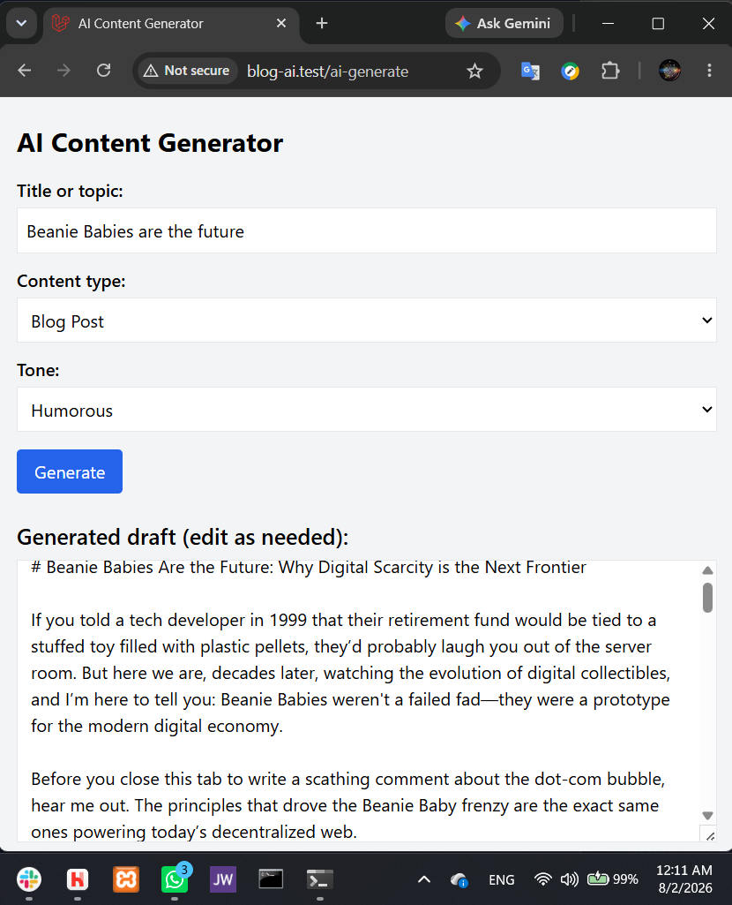

# Laravel Gemini API Multi-type Content Generator
CS 85 Module 12, Assignment 12A, by Gregory Hagen, 8/1/26

## App Description
This web app shows a form which lets the user enter a title and choose whether Gemini should generate a full blog post, a meta description (for web page SEO), or an email subject line, based on the user-specified title. The form also lets the user choose the desired tone (professional, casual, or humorous). When the user clicks "Generate", the app submits the request to Gemini's API and then displays the result in an editable text area on the form, which preserves the user's last choices and allows the user to change choices (or not) and "Generate" again. The app logs and handles errors gracefully. It includes a mock test method so the app itself can be tested without calling the API (to save AI tokens).

### *The app separates responsibilities thus:*
**View (`ai_form.blade.php`):** Displays the form and output<br>
**Controller (`AiContentController.php`):** Validates input, delegates to service, passes output to view<br>
**Service (`AiContentService.php`):** Builds the prompt, calls Gemini API, returns content

**My API key is not exposed** because it is not in the code; it is only in my .env file, which git ignores. You can put your API key in your .env file, modify the app, and publish it on GitHub (credit me please!), and your API key will not be exposed.

## Setup Instructions

### Prerequisites
- Laravel Herd (includes PHP 8.4 and Composer)
- Git
- A Gemini API key (free with a free Gmail account) from http://aistudio.google.com/app/apikey (As soon as you get the key, copy and save it so that you don't lose it. If you want, you can wait until you reach step 4 below to get the key, so that you can paste it directly into .env and just save it there.)

### Installation

1. In your CLI, `cd` to your Herd folder (e.g., Windows: `C:\Users\YourName\Herd\` or Mac: `~/Sites/`) and clone the repository there:
```
git clone https://github.com/Greg01001000/cs85_module12.git
cd cs85_module12
```

2. Install PHP dependencies:
```
composer install
```

3. Copy the environment file and generate an app key:
```
Windows: cs85_module12>copy .env.example .env
or Mac: cs85_module12 % cp .env.example .env
Both: php artisan key:generate
```

4. Test the app itself without needing a server or calling the API yet by running this in your CLI:
```
php artisan test
```
The output should end with `Tests:    3 passed (6 assertions)`

5. In your favorite text editor, open `.env` and near the end of the file, in the line, `GEMINI_API_KEY=your_gemini_api_key_here`, paste your Gemini API key in place of `your_gemini_api_key_here`.

6. Make sure the Herd app is running with the web server (e.g., services NGINX and PHP-8.4) active, and visit the app in your browser at `http://cs85_module12.test`


### Notes
- No npm or Node.js is required — this app uses no compiled assets
- The list of Gemini models usable on the free tier changes occasionally. If you get the error, "AI request failed: Failed to communicate with AI service", try changing the model specified in `.env` . https://ai.google.dev/gemini-api/docs/pricing has a not-necessarily up-to-date list of available models and their API names which you can copy and paste into `.env`, on the line, `GEMINI_MODEL=gemini-3.1-flash-lite` to try different models, or you can try `gemini-flash-latest` , but I don't know whether that model spec will always work with the free tier.

## Resulting Web Page


## Reflection
1. ***How did the AI output change when you modified the tone or role in your prompt?*** The length, style, and tone changed to match the specified tone or role—-e.g., a humorous blog post used wordplay and lighter language, while a professional one used formal structure and industry terminology.
2. ***How did your prompt differ across the three content types, and why?*** Each content type required a different role, task, length, and format. The blog post prompt defines a tech blogger role and requests 400–600 words of structured markdown with an introduction, subheadings, examples, and a conclusion — because a blog post is a complete, standalone document meant to educate and engage. The meta description prompt defines an SEO expert role and requests a single sentence of 150–160 characters containing relevant keywords — because meta descriptions have a strict character limit imposed by search engines and must be scannable at a glance. The email subject line prompt defines an email marketing expert role and requests a single line of 40–60 characters — because email clients truncate longer subject lines and the entire goal is to compel the recipient to open the email in a few words. In each case the length, format, and role were chosen to match the real-world constraints and purpose of that content type.
3. ***What would you improve about the API integration for a production app?***
- More content types and tones could be added for the user to choose from.
- Caching prompts and results could save tokens in case of identical, repeated prompts, and longer-term storage could satisfy users' need to retrieve that perfectly-written content that they can't replicate now, no matter how many varied prompts they try.
- To deal with rate limits, automatic retries with exponential backoff could turn failed requests into successes.
- Another field in the form could let the user choose how many alternative content examples they want to choose from, generated from one submission.
- Monitoring API token costs and enforcing spending limits could prevent runaway costs.
- The maxOutputTokens limit could be different for each content type, since the length of each content type is very different.